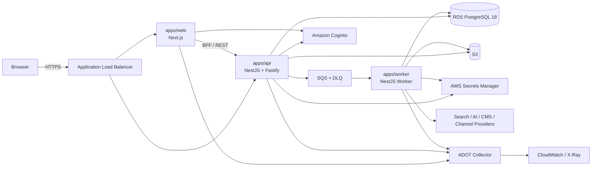

# System Architecture

## Status

本仓库是 greenfield 项目。截至 2026-07-20，除规格文档与 `GEO_Agent_Implementation_Playbook_v1.0.docx` 外没有生产代码、package manifest、数据库 migration、测试或 CI。本文件描述的是已确认的目标架构，不代表当前已有实现。

## Architectural Drivers

- 多租户硬隔离：`Tenant/Organization` 是合同、计费、密钥、数据保留与审计边界；`Workspace` 是公司/品牌项目边界。
- 行业中立：统一使用 `Offering` 表达产品、服务或解决方案，属性与 taxonomy 可扩展，不包含固定行业 enum。
- Evidence-first：所有对外事实必须追溯到 Approved Claim 与 Evidence Source。
- Approval-first：生成 Agent 不能审批自己的产物；Publisher 只能发布 Reviewer 批准的 exact revision/hash。
- Reproducible measurement：Provider、surface、model/version、locale、region、时间、参数、成本、原始回答、引用和错误全部保留。
- Failure transparency：`ERROR`、`NOT_CHECKED`、`INCONCLUSIVE` 与 `NOT_APPLICABLE` 不伪装成零分或成功。
- Residency：平台数据面固定在 AWS Singapore `ap-southeast-1`，外部 Provider 跨境处理必须显式批准。
- 不承诺第三方结果：平台不保证搜索收录、排名、AI 引用或推荐。

## Process Boundaries

- `apps/web`：UI、SSR、BFF/session boundary；不得执行长时 Agent job，也不得读取 Connector secret。
- `apps/api`：REST/OpenAPI、认证后的 membership/RBAC、tenant scope、审批、预算、job orchestration 与 Adapter capability checks。
- `apps/worker`：抓取、生成、内容审计、发布、measurement、retention 与 export 等异步 job。
- 三个 app 共用 `packages/domain`、`packages/contracts`、`packages/application`，但以独立容器进程部署。
- 外部 Provider 永远通过 `packages/adapters` 的 versioned port 调用；domain/application 不直接依赖 Provider SDK。

## Data Boundaries

- PostgreSQL 是事务状态真源；Tenant-owned table 必须含 `tenant_id`，启用 `FORCE ROW LEVEL SECURITY`。
- S3 保存 crawl snapshot、raw evidence、screenshot、Artifact payload 与 export；数据库只保存 metadata、hash、lineage 和 object reference。
- Secrets Manager 保存每个 Connector Authorization 的 credential；数据库只保存 secret ARN 与非敏感 metadata。
- SQS 只携带 ID、scope、job type、attempt 与 `schemaVersion`；不携带正文、Prompt、raw response 或 secret。
- Audit Event 写入 append-only ledger，并把周期 digest 写入启用 Object Lock 的 Audit Evidence bucket。

## Core State Machines

- `Claim`: `DRAFT → NEEDS_EVIDENCE → REVIEW_PENDING → APPROVED | REJECTED | EXPIRED`。
- `ArtifactRevision`: `DRAFT → REVIEW_PENDING → APPROVED | REJECTED → PUBLISH_PENDING → PUBLISHED | FAILED | WITHDRAWN`。
- `Job`: `QUEUED → RUNNING → SUCCEEDED | FAILED_RETRYABLE | FAILED_TERMINAL | CANCELLED | BUDGET_BLOCKED`。
- `MeasurementRun`: `QUEUED → RUNNING → COMPLETED | PARTIAL | ERROR | CANCELLED`；单项结果另有 `PASS/FAIL/NOT_CHECKED/INCONCLUSIVE/ERROR/NOT_APPLICABLE`。
- 状态转换只能通过 application command；不能通过通用 CRUD 任意覆盖状态字段。

## Deployment Assumptions

- AWS `ap-southeast-1`，两个 Availability Zones，private subnets 承载 compute/data plane，只有 ALB 公开。
- ECS Fargate 运行 Web/API/Worker；ECR 保存 immutable image；生产以 digest 部署。
- RDS PostgreSQL 18 Multi-AZ，SQS Standard + DLQ，S3，KMS，Secrets Manager，Cognito，CloudWatch/X-Ray。
- OpenTofu 1.11.x 是基础设施 source of truth；GitHub Actions 通过 OIDC 使用短期 AWS role。
- MVP 搜索使用 PostgreSQL FTS、`pg_trgm` 与 `pgvector`，不部署 OpenSearch。

## Unknown Implementation Details

- `<unknown>`：最终 AWS account IDs、域名、VPC CIDR、KMS ARN、Cognito pool ID 与 Provider credential；这些属于部署参数，不改变架构。
- `<unknown>`：具体第三方 Channel Adapter 上线清单取决于 API 审批和平台条款；核心只冻结 capability contract。
- `<unknown>`：各 AI/search consumer surface 的合法采集可用性会变化，由 Method Registry/Adapter Registry 运行时声明，不写死为永远可用。

## Source Constraints

原始 `GEO_Agent_Implementation_Playbook_v1.0.docx` 的 Artifact lineage、Claim Ledger、approval matrix、measurement scenario、failure semantics、Agent secret isolation 与不承诺排名原则是架构不变量。附录中的行业示例只作为示例，不得进入 closed enum 或固定工作流。
